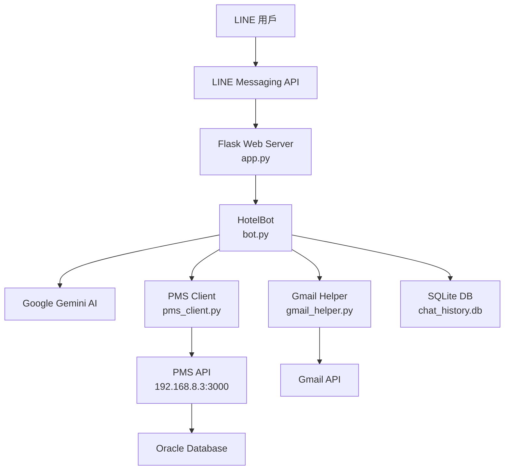

# KTW Hotel LINE Bot v1.1.0 技術文檔

## 📋 版本資訊

- **當前版本**：v1.1.0
- **發布日期**：2025-12-11
- **前一版本**：v1.0.1 (2025-12-10)

---

## 🎯 系統概述

KTW Hotel LINE Bot 是一個智能旅館客服系統，整合了 LINE Messaging API、Google Gemini AI、PMS 資料庫和 Gmail API，提供 24/7 自動化客戶服務。

### 核心功能
- ✅ 訂單查詢（支援姓名、電話、訂單號）
- ✅ 入住資訊確認
- ✅ 天氣預報查詢
- ✅ AI 智能對話
- ✅ 客人資料收集與更新
- ✅ 對話歷史記錄

---

## 🆕 V1.1.0 新增功能

### 1. 重新開始對話功能
**觸發關鍵字**：
- 「重新開始」
- 「reset」
- 「restart」
- 「清除對話」

**功能說明**：
用戶可隨時重置對話歷史，清除上下文記憶，重新開始新的諮詢。

---

### 2. 早餐資訊自動判斷
**判斷邏輯**：
1. 檢查訂單備註是否包含「不含早」
2. 檢查房型名稱是否包含「不含早」
3. 預設顯示「有」（含早餐）

**顯示範例**：
```
早餐：有
早餐：無（不含早）
```

---

### 3. 房型對照表獨立管理
**檔案位置**：`/Users/ktw/KTW-bot/room_types.json`

**優點**：
- ✅ 新增或修改房型無需修改程式碼
- ✅ 支援中英文雙語顯示
- ✅ 便於旅館人員自行維護

**房型對照表格式**：
```json
{
  "SD": {
    "zh": "標準雙人房",
    "en": "Standard Double"
  },
  "DT": {
    "zh": "豪華雙床房",
    "en": "Deluxe Twin"
  }
}
```

---

## 🔧 V1.1.0 改進優化

### 1. 訂單來源判斷邏輯優化

**舊版問題**：
- ❌ 優先使用 OTA ID 前綴判斷
- ❌ 容易將官網訂單誤判為 Booking.com

**新版邏輯（優先順序）**：
1. **第一優先**：檢查 `remarks` 欄位關鍵字
   - 「官網」 → 官網訂單
   - 「agoda」 → Agoda
   - 「booking.com」 → Booking.com
   
2. **第二優先**：OTA ID 前綴
   - `RMAG` 開頭 → Agoda
   - `RMPGP` 開頭 → Booking.com

**範例**：
```
訂單 RMPGP12345，備註：官網訂單
舊版：Booking.com ❌
新版：官網 ✅
```

---

### 2. PMS API 數據處理增強

**支援鍵名格式**：
- ✅ 大寫：`ROOM_TYPE_CODE`、`ROOM_COUNT`、`ROOM_TYPE_NAME`
- ✅ 小寫：`room_type_code`、`room_count`、`room_type_name`

**錯誤處理改善**：
```python
# 舊版（會報錯）
room_type = room['room_type_name']

# 新版（安全存取）
room_type = room.get('room_type_name', '未知')
```

---

### 3. AI 模型升級

| 項目 | 舊版 | 新版 |
|:---|:---|:---|
| **主對話模型** | Gemini 2.0 Flash Exp | **Gemini 2.5 Flash** |
| **理解能力** | 良好 | **更好** |
| **回應速度** | 快速 | **更快** |
| **準確性** | 高 | **更高** |

---

### 4. 系統指令優化

**改進重點**：
- ✅ 強制要求 Bot 必須原樣輸出 `formatted_display`
- ✅ 禁止跳過訂單詳情顯示步驟
- ✅ 添加正確/錯誤流程示例

**效果**：
- 訂單資訊顯示更穩定
- 減少 AI 自作主張的行為

---

## 🐛 V1.1.0 錯誤修復

### 1. KeyError 問題修復

**問題描述**：
當 PMS API 返回資料中某些欄位為 `null` 時，程式會崩潰。

**修復內容**：
```python
# 修復前
room_type_name = room['room_type_name']  # KeyError if null
room_count = room['room_count']          # KeyError if null

# 修復後
room_type_name = room.get('room_type_name')
room_count = room.get('room_count', 1)
```

**影響範圍**：
- ✅ `room_type_name`
- ✅ `room_count`
- ✅ 所有字典訪問操作

---

### 2. 隱私檢查邏輯修復

**問題描述**：
Gmail 隱私檢查會誤攔截未來訂單和近期訂單。

**修正邏輯**：

| 情境 | DAYS_AGO | 舊版 | 新版 |
|:---|:---:|:---:|:---:|
| 未來訂單 | < 0 | ❌ 被攔截 | ✅ 允許顯示 |
| 0-5天內訂單 | 0-5 | ❌ 被攔截 | ✅ 允許顯示 |
| 5天前訂單 | > 5 | ✅ 攔截 | ✅ 攔截 |

---

## 📊 系統架構



---

## 🔧 重要檔案說明

| 檔案 | 功能 | 位置 |
|:---|:---|:---|
| `app.py` | Flask 主程式，處理 LINE Webhook | `/Users/ktw/KTW-bot/` |
| `bot.py` | Bot 核心邏輯，對話管理 | `/Users/ktw/KTW-bot/` |
| `pms_client.py` | PMS API 客戶端 | `/Users/ktw/KTW-bot/` |
| `room_types.json` | 房型對照表 ⭐ 新增 | `/Users/ktw/KTW-bot/` |
| `admin_dashboard.py` | 管理後台 | `/Users/ktw/KTW-bot/` |
| `CHANGELOG.md` | 版本變更記錄 ⭐ 新增 | `/Users/ktw/KTW-bot/` |

---

## 🚀 啟動與管理

### 啟動 Bot 服務
```bash
cd /Users/ktw/KTW-bot
python3 app.py
```

### 啟動管理後台
```bash
cd /Users/ktw/KTW-bot
python3 admin_dashboard.py
```

### 重新啟動腳本
```bash
cd /Users/ktw/KTW-bot
./restart.sh
```

---

## 🔗 相關連結

- **PMS API 文檔**：參見 `PMS API v1.6 技術文檔`（獨立文件）
- **GitHub**：https://github.com/kueitiwan-KTW/KTW-bot
- **Git Tag**：`bot-v1.1.0`

---

## 📝 後續規劃

### 計畫新增功能
- [ ] 多語言支援（英文、日文）
- [ ] 房間升級推薦
- [ ] 自動退房提醒
- [ ] 滿意度調查

### 技術債務
- [ ] 單元測試覆蓋率提升
- [ ] API 回應時間優化
- [ ] 錯誤監控系統建立

---

**文檔版本**：1.0  
**最後更新**：2025-12-11  
**維護者**：KTW Hotel IT Team
