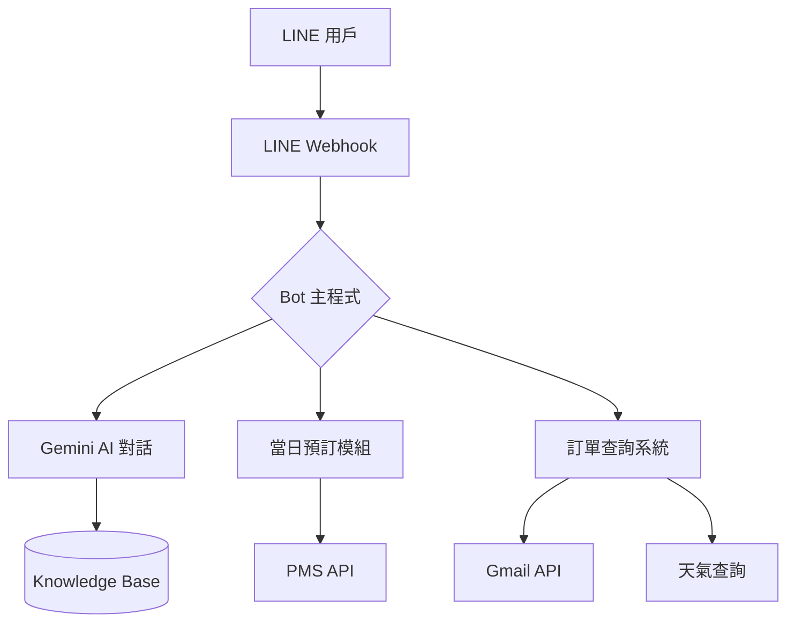

# 龜地灣旅棧 LINE BOT 完整說明文件

> 版本：2.0  
> 更新日期：2025-12-16  
> 使用模型：Gemini 2.5 Flash

---

## 📌 系統架構



---

## 🤖 核心功能

### 1. AI 智慧客服
- **技術**：Gemini 2.5 Flash
- **知識庫**：`knowledge_base.json`（FAQ + LINE 歷史對話）
- **支援**：文字、圖片、語音辨識

### 2. 訂單查詢
| 功能 | 說明 |
|------|------|
| 自動識別訂單編號 | 5位數以上自動觸發查詢 |
| 圖片識別 | 上傳訂單截圖自動提取 |
| 訂單來源 | 官網 (RMPGP) / OTA |
| 天氣提醒 | 自動查詢入住日天氣 |

### 3. 當日預訂
| 功能 | 說明 |
|------|------|
| 狀態機對話 | 引導式多輪問答 |
| 房型選擇 | SD/ST/SQ（編號 2/3/4）|
| 多房型支援 | 「1間雙人1間三人」|
| 自動升等 | 庫存不足時自動升等 |
| 自助取消 | 發送「取消訂單」|

### 4. AI 訂房意圖判斷（新功能）
- **觸發**：「想住」「有房嗎」「我要訂房」
- **流程**：先詢問日期 → 今天走當日預訂 / 未來走官網

### 5. VIP 客戶功能
| 功能 | 說明 |
|------|------|
| VIP 狀態識別 | 自動識別已標記的 VIP 用戶 |
| Dashboard 標記 | Admin 即時顯示 VIP 標籤 |
| 優先推送 | VIP 訊息優先顯示 |
| 配置檔 | `vip_users.json` |

**VIP 用戶配置格式**：
```json
{
  "vip_users": [
    "U1234567890abcdef...",
    "Uabcdef1234567890..."
  ]
}
```

### 6. Admin Dashboard 即時推送
- **技術**：Node.js WebSocket
- **推送內容**：
  - 用戶 ID、名稱、頭像
  - 訊息內容
  - VIP 狀態
  - 時間戳記

---

## 📋 對話流程圖

### 一般問答
```
用戶 → 發送訊息 → AI 判斷意圖 → 回覆
```

### 訂單查詢
```
用戶：250285738
  ↓
AI：找到訂單，顯示詳情
  ↓
AI：入住天氣提醒
  ↓
AI：確認電話、抵達時間
```

### 訂房意圖
```
用戶：我要訂房
  ↓
AI：請問哪天入住？
  ↓ 
用戶：今天 → 當日預訂流程
      明天 → 提供官網連結
```

### 當日預訂
```
1. 選房型（2/3/4 或「1間雙人1間三人」）
2. 選數量（1-4間）
3. 選床型
4. 提供姓名、電話、抵達時間
5. 確認預訂
```

---

## 🔧 檔案結構

```
/Users/ktw/KTW-bot/
├── bot.py                 # 主程式（AI對話、訂單查詢）
├── same_day_booking.py    # 當日預訂模組
├── pms_client.py          # PMS API 客戶端
├── knowledge_base.json    # 知識庫 FAQ
├── persona.txt            # AI 人格設定
├── gmail_helper.py        # Gmail 訂單查詢
├── weather_helper.py      # 天氣查詢
├── chat_logger.py         # 對話記錄
└── app.py                 # Flask Webhook
```

---

## 🛠 API 端點

### PMS API（192.168.8.3:3000）

| 端點 | 方法 | 說明 |
|------|------|------|
| `/api/rooms/today-availability` | GET | 今日房況 |
| `/api/bookings/same-day` | POST | 創建當日訂單 |
| `/api/bookings/same-day-list` | GET | 當日訂單列表 |
| `/api/bookings/same-day/:id/cancel` | PATCH | 取消訂單 |
| `/api/bookings/same-day/:id/checkin` | PATCH | 標記已 KEY |

---

## 📊 訂單狀態

| 狀態 | 顯示 | 說明 |
|------|------|------|
| `pending` | 🟡 待入住 | 等待客人抵達 |
| `checked_in` | 🟢 已 KEY | 已入住 |
| `cancelled` | 🔴 已取消 | 客人取消 |
| `interrupted` | 🔵 預約中斷 | 對話中斷 |

---

## ⏰ 服務時間

- **當日預訂**：每日 22:00 前
- **櫃檯服務**：15:00 - 23:00
- **入住時間**：15:00
- **退房時間**：11:00

---

## 🔑 關鍵字觸發

### 當日預訂（交給 AI 判斷）
- 我要訂房、想住、有房嗎、空房

### 取消訂單
- 取消訂單、我要取消、不住了

### 中斷對話
- 算了、謝謝、不用了

---

## 📝 PM2 服務

```bash
# 查看狀態
npx pm2 list

# 重啟服務
npx pm2 restart Line-Bot-Py
npx pm2 restart DT-Admin-Web
npx pm2 restart DT-Backend

# 查看日誌
npx pm2 logs Line-Bot-Py --lines 50
```

---

## 🚀 未來規劃

- [ ] 多語言支援
- [ ] 訂單修改功能
- [ ] 積分會員系統
- [ ] 推播行銷訊息
