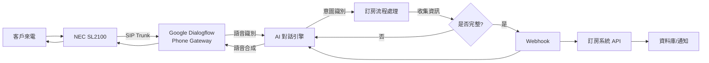

# NEC SL2100 AI 語音訂房助理整合專案

## 專案目標

在現有的 NEC SL2100 電話系統上建置 AI 語音助理，實現以下功能：
1. 自動接聽客戶來電
2. 透過自然語音對話處理訂房需求
3. 收集訂房資訊（入住日期、退房日期、房型、人數等）
4. 記錄訂房資料至系統

## 需使用者審核的事項

> [!IMPORTANT]
> **技術方案選擇**
> 
> 本計畫提供三種整合方案，各有優缺點，請選擇最符合您需求的方案：
> 
> **方案 A：Google Dialogflow + Phone Gateway**
> - ✅ 優點：快速建置、易於維護、強大的 AI 能力
> - ❌ 缺點：主要支援美國電話、需要 Google Cloud 費用
> - 💰 成本：中等（按使用量計費）
> - ⚙️ 複雜度：低
> 
> **方案 B：開源方案（Asterisk + Twilio + AI API）**
> - ✅ 優點：完全可控、靈活度高、支援台灣電話
> - ❌ 缺點：需要較多技術能力、維護成本高
> - 💰 成本：中低（Twilio SIP Trunk + AI API 費用）
> - ⚙️ 複雜度：高
> 
> **方案 C：商用 SIP AI 平台（如 Vapi、ElevenLabs）**
> - ✅ 優點：專為 AI 語音設計、功能完整、支援多語言
> - ❌ 缺點：月費較高、功能可能過於豐富
> - 💰 成本：高（月費制）
> - ⚙️ 複雜度：低

> [!WARNING]
> **訂房系統整合策略**
> 
> **現況**：已有 PMS 系統，但目前無法存取其內部資料
> 
> **過渡方案**：
> - 階段 1：建立獨立的「訂房需求記錄系統」，收集客戶訂房資訊後通知管理人員，由人工轉入 PMS
> - 階段 2（未來）：待 PMS API 開放後，直接整合實現自動訂房與即時查詢
> 
> **資料處理方式選項**：
> 1. **Email 通知**：AI 收集完資訊後寄送到指定信箱（最簡單）
> 2. **Google Sheets**：自動寫入試算表，方便管理與匯出（推薦）
> 3. **獨立資料庫**：建立簡易資料庫，提供網頁介面查看（較完整）
> 4. **LINE Notify**：即時通知到 LINE（快速提醒）
> 
> 請選擇最符合您工作流程的方式，或可以同時使用多種方式（例如：Google Sheets + LINE Notify）。

## 建議方案架構

基於快速建置與成本考量，**建議採用方案 A（Google Dialogflow）或方案 C（商用 SIP AI 平台）**。以下以方案 A 為例說明架構：

### 系統架構圖



### 資料流程

1. **來電接聽**：客戶撥打飯店電話 → NEC SL2100 接收
2. **路由至 AI**：透過 SIP Trunk 轉接至 Dialogflow Phone Gateway
3. **語音對話**：
   - AI：「您好，歡迎致電 XX 飯店，請問需要什麼服務？」
   - 客戶：「我想訂房」
   - AI：「好的，請問入住日期？」
   - 客戶：「12 月 15 號」
   - AI：「退房日期呢？」
   - 客戶：「12 月 17 號」
   - AI：「請問幾位客人？」
   - 客戶：「兩位大人」
   - AI：「需要什麼房型？」
   - 客戶：「雙人房」
4. **資料確認**：AI 覆述資訊並請客戶確認
5. **資料處理**：透過 Webhook 將訂房資訊傳送至後端系統
6. **完成通知**：AI 告知客戶訂房已記錄，將有專人聯繫確認

## 建議的變更項目

### NEC SL2100 配置

#### [MODIFY] NEC SL2100 系統設定
- 配置 SIP Trunk 連接至外部 AI 語音平台
- 設定來電路由規則（將特定號碼或所有來電轉接至 AI 助理）
- 配置 VoIP 通道授權（每個 SIP Trunk 需要授權）
- 設定網路參數（IP、子網路遮罩、閘道、DNS）

**需要的 NEC SL2100 程式設定**：
- Program 10-28：SIP 系統資訊
- Program 10-29：SIP 伺服器資訊
- Program 10-36：SIP Trunk 註冊資訊
- Program 84-13：SIP Trunk 編解碼器
- Program 22-02：來電路由設定
- Program 22-11：DID 轉換表

---

### AI 語音平台設置（以 Dialogflow 為例）

#### [NEW] Google Cloud 專案
- 建立 Google Cloud 專案
- 啟用 Dialogflow API
- 設定計費帳戶

#### [NEW] Dialogflow Agent 配置
- 建立專用的 Dialogflow Agent
- 設定語言為繁體中文（zh-TW）
- 配置 Phone Gateway 整合

#### [NEW] 對話流程設計

**Intent（意圖）定義**：
- `Welcome`：歡迎詞
- `BookRoom`：訂房意圖
- `CheckAvailability`：查詢可用性
- `ProvideGuestInfo`：提供客人資訊
- `ConfirmBooking`：確認訂房
- `Fallback`：未識別意圖處理

**Entity（實體）定義**：
- `@sys.date`：日期（入住/退房）
- `@sys.number`：人數
- `@room_type`：房型（單人房、雙人房、四人房、套房等）
- `@guest_name`：客人姓名
- `@phone_number`：聯絡電話

**Parameters（參數）收集**：
- `check_in_date`（必填）
- `check_out_date`（必填）
- `guest_count`（必填）
- `room_type`（必填）
- `guest_name`（選填）
- `contact_phone`（選填）

---

### 訂房資料處理系統（過渡方案）

由於目前有 PMS 但無法存取其資料，我們將建立獨立的訂房需求記錄系統，收集客戶資訊後通知管理人員手動處理。

#### [NEW] Webhook 服務（Node.js / Python）
建立雲端函式（推薦使用 Google Cloud Functions）處理 Dialogflow 的 Webhook 請求

**核心功能**：
- 接收 Dialogflow 傳來的訂房資訊
- 驗證資料完整性（日期邏輯、必填欄位）
- 執行選定的資料處理方式

---

#### 方案 1：Email 通知（最簡單）

**實作**：
```javascript
// Cloud Function 範例
const nodemailer = require('nodemailer');

exports.dialogflowWebhook = async (req, res) => {
  const params = req.body.queryResult.parameters;
  
  const emailContent = `
    新訂房需求：
    入住日期：${params.check_in_date}
    退房日期：${params.check_out_date}
    房型：${params.room_type}
    人數：${params.guest_count}
    客人姓名：${params.guest_name || '未提供'}
    聯絡電話：${params.contact_phone || '未提供'}
  `;
  
  await transporter.sendMail({
    to: 'hotel@example.com',
    subject: '新訂房需求',
    text: emailContent
  });
  
  res.json({
    fulfillmentText: '已收到您的訂房需求，我們將盡快與您聯繫確認。'
  });
};
```

---

#### 方案 2：Google Sheets（推薦）

**實作**：
- 使用 Google Sheets API 自動寫入試算表
- 方便查看、篩選、匯出資料
- 可設定試算表通知提醒

```javascript
// 使用 Google Sheets API
const { google } = require('googleapis');

exports.dialogflowWebhook = async (req, res) => {
  const params = req.body.queryResult.parameters;
  const sheets = google.sheets('v4');
  
  await sheets.spreadsheets.values.append({
    spreadsheetId: 'YOUR_SHEET_ID',
    range: 'A:H',
    valueInputOption: 'USER_ENTERED',
    resource: {
      values: [[
        new Date().toISOString(),
        params.check_in_date,
        params.check_out_date,
        params.room_type,
        params.guest_count,
        params.guest_name || '',
        params.contact_phone || '',
        'pending'
      ]]
    }
  });
  
  res.json({
    fulfillmentText: '已收到您的訂房需求，我們將盡快與您聯繫確認。'
  });
};
```

---

#### 方案 3：獨立資料庫 + 管理介面

**資料表結構**：
```sql
CREATE TABLE booking_requests (
    id SERIAL PRIMARY KEY,
    check_in_date DATE NOT NULL,
    check_out_date DATE NOT NULL,
    guest_count INTEGER NOT NULL,
    room_type VARCHAR(50) NOT NULL,
    guest_name VARCHAR(100),
    contact_phone VARCHAR(20),
    status VARCHAR(20) DEFAULT 'pending',
    created_at TIMESTAMP DEFAULT NOW(),
    processed_at TIMESTAMP,
    notes TEXT
);
```

**簡易管理介面**：建立網頁讓管理人員查看待處理的訂房需求

---

#### 方案 4：LINE Notify（即時通知）

**實作**：
```javascript
const axios = require('axios');

async function sendLineNotify(message) {
  await axios.post('https://notify-api.line.me/api/notify', 
    `message=${encodeURIComponent(message)}`,
    {
      headers: {
        'Authorization': `Bearer YOUR_LINE_TOKEN`,
        'Content-Type': 'application/x-www-form-urlencoded'
      }
    }
  );
}

exports.dialogflowWebhook = async (req, res) => {
  const params = req.body.queryResult.parameters;
  
  const message = `
📞 新訂房需求
📅 入住：${params.check_in_date}
📅 退房：${params.check_out_date}
🛏 房型：${params.room_type}
👥 人數：${params.guest_count}
👤 姓名：${params.guest_name || '未提供'}
📱 電話：${params.contact_phone || '未提供'}
  `;
  
  await sendLineNotify(message);
  
  res.json({
    fulfillmentText: '已收到您的訂房需求，我們將盡快與您聯繫確認。'
  });
};
```

---

#### 建議組合方案

**最佳實踐**：Google Sheets + LINE Notify
- Google Sheets 作為主要記錄（方便查詢與管理）
- LINE Notify 提供即時提醒
- 兩者結合可確保訊息不遺漏，且便於後續處理

## 驗證計畫

### 自動化測試

#### Dialogflow 模擬器測試
1. 進入 Dialogflow Console
2. 使用右側的「Try it now」測試面板
3. 測試對話流程：
   - 輸入：「我想訂房」
   - 確認 AI 能正確識別 `BookRoom` 意圖
   - 逐步提供入住日期、退房日期、人數、房型
   - 驗證 AI 是否正確收集所有必填參數

#### Webhook 功能測試
```bash
# 使用 curl 或 Postman 測試 Webhook
curl -X POST [Webhook URL] \
  -H "Content-Type: application/json" \
  -d '{
    "queryResult": {
      "parameters": {
        "check_in_date": "2025-12-15",
        "check_out_date": "2025-12-17",
        "guest_count": 2,
        "room_type": "雙人房",
        "guest_name": "王小明",
        "contact_phone": "0912345678"
      }
    }
  }'
```

預期結果：
- Webhook 成功接收請求
- 資料正確寫入資料庫或發送通知
- 回傳成功確認訊息

### 手動驗證

#### 電話整合測試
1. 配置完成後，撥打 Dialogflow Phone Gateway 提供的測試電話號碼
2. 進行完整的訂房對話流程
3. 驗證項目：
   - ✓ 語音識別準確度（是否能正確辨識繁體中文）
   - ✓ 對話流程順暢度
   - ✓ 資料收集完整性
   - ✓ 確認資料是否正確儲存

#### NEC SL2100 整合測試
1. 將 NEC SL2100 的 SIP Trunk 連接至 Dialogflow
2. 從外部撥打飯店電話號碼
3. 驗證項目：
   - ✓ 來電是否正確轉接至 AI 助理
   - ✓ 語音品質是否清晰
   - ✓ 通話是否穩定（無斷線）
   - ✓ 完整訂房流程測試

#### 使用者驗收測試
1. 邀請飯店員工或實際客戶進行測試
2. 收集反饋：
   - AI 回應是否自然？
   - 是否有遺漏的常見問題？
   - 訂房流程是否符合實際需求？
3. 根據反饋調整對話流程與回應內容

### 壓力測試（選做）
- 模擬多通同時來電
- 驗證 VoIP 通道是否足夠
- 確認系統穩定性

## 預計時程

- **第 1 週**：確認技術方案、建立 Google Cloud 專案、設計對話流程
- **第 2 週**：配置 NEC SL2100 SIP Trunk、建置 Dialogflow Agent
- **第 3 週**：開發 Webhook 服務、整合訂房資料處理
- **第 4 週**：測試與調整、使用者驗收

## 成本估算

### Google Dialogflow
- Phone Gateway：約 USD $0.06/分鐘（通話費用）
- Dialogflow API：前 1000 次請求免費，之後約 USD $0.002/次

### 其他成本
- NEC SL2100 SIP Trunk 授權（若未啟用）
- 雲端主機費用（若自建 Webhook 服務）
- 或 Google Cloud Functions 費用（按使用量計費）

**預估月費**（假設每月 500 通電話，平均每通 3 分鐘）：
- 電話費用：500 × 3 × $0.06 = USD $90
- Dialogflow API：可忽略
- **總計約 USD $90-100/月**
