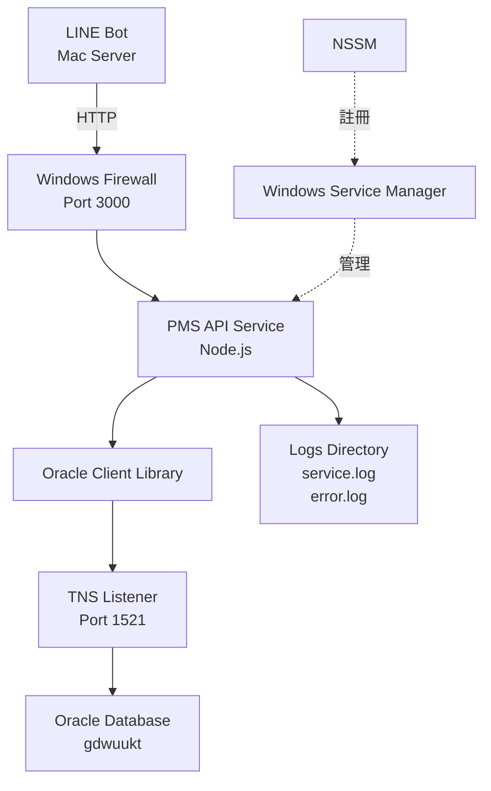

# KTW Hotel PMS API v1.6 技術文檔

## 📋 版本資訊

- **當前版本**：v1.6
- **發布日期**：2025-12-11
- **前一版本**：v1.0.0 (2025-12-10)
- **重大更新**：Windows Service 支援 + Oracle 連線修復

---

## 🎯 系統概述

PMS API 是一個 Node.js REST API 服務，用於將 Oracle PMS 資料庫數據提供給 LINE Bot 使用。本次 v1.6 版本主要解決了生產環境的穩定性問題，並實現了開機自動啟動功能。

### 執行環境
- **作業系統**：Windows Server
- **Node.js 版本**：v20.10.0
- **資料庫**：Oracle Database 12.2.0
- **服務端口**：3000

---

## 🆕 V1.6 新增功能

### 1. Windows Service 支援 ⭐ 重大更新

**問題背景**：
- ❌ 舊版需手動執行 `npm start`
- ❌ 登出 Windows 後服務會停止
- ❌ 重開機後需手動重啟

**新版解決方案**：
使用 **NSSM (Non-Sucking Service Manager)** 將 API 註冊為 Windows 系統服務。

**優勢**：
- ✅ **開機自動啟動**（無需登入）
- ✅ **背景運行**（登出也不會停止）
- ✅ **自動重啟**（崩潰後自動恢復）
- ✅ **日誌記錄**（自動保存到 logs 目錄）

---

### 2. 服務管理腳本

#### 安裝腳本：`install-service.bat`
**功能**：
- 自動偵測 Node.js 路徑
- 檢查 NSSM 是否存在
- 註冊 Windows Service
- 設定開機自動啟動

**使用方法**：
```batch
# 以管理員身分執行
install-service.bat
```

---

#### 管理腳本：`manage-service.bat`
**功能選單**：
1. 啟動服務 (Start)
2. 停止服務 (Stop)
3. 重新啟動 (Restart)
4. 檢查狀態 (Status)
5. 離開 (Exit)

**使用方法**：
```batch
# 以管理員身分執行
manage-service.bat
```

---

#### 卸載腳本：`uninstall_service.js`
**功能**：
- 完全移除 Windows Service

**使用方法**：
```bash
cd C:\KTW-bot\pms-api
node uninstall_service.js
```

---

## 🛠️ V1.6 重大修復

### 1. Oracle Listener 連線問題 ⚠️ 緊急修復

#### 問題描述
**錯誤訊息**：
```
ORA-12170: TNS: Connect timeout occurred
TNS-12560: TNS: protocol adapter error
```

**症狀**：
- ❌ Dean 客戶端無法連接資料庫
- ❌ Node.js API 無法查詢 PMS 資料
- ❌ TNS Listener 服務啟動失敗

---

#### 根本原因分析

##### 問題 1：系統環境變數衝突
**環境分析**：
- Windows Server 上安裝了兩個 Oracle：
  - **C 盤**：`C:\app\oracle\product\12.2.0\dbhome_1`（舊版客戶端）
  - **D 盤**：`D:\app\product\12.2.0\dbhome_1`（主資料庫伺服器）

**錯誤配置**：
```
系統環境變數 ORACLE_HOME = C:\app\oracle\product\12.2.0\dbhome_1
實際 Listener 位置 = D:\app\product\12.2.0\dbhome_1
```

**結果**：
- Listener 服務找不到正確的執行檔
- 啟動失敗

---

##### 問題 2：listener.ora 配置缺失

**錯誤配置**：
```ini
# listener.ora (修復前)
LISTENER =
  (DESCRIPTION =
    (ADDRESS = (PROTOCOL = TCP)(HOST = 192.168.8.3)(PORT = 1521))
  )

SID_LIST_LISTENER =
  (SID_LIST =
    (SID_DESC =
      (SID_NAME = CLRExtProc)
      (ORACLE_HOME = D:\app\product\12.2.0\dbhome_1)
      (PROGRAM = extproc)
    )
    # 缺少主資料庫 SID！
  )
```

**問題**：
- ❌ 只配置了 `CLRExtProc`（擴展程序）
- ❌ 沒有配置主資料庫 `gdwuukt`

---

#### 修復方案

##### 修復 1：移除系統級 ORACLE_HOME
**操作步驟**：
1. 開啟「系統內容」→「環境變數」
2. 從「系統變數」中**刪除** `ORACLE_HOME`
3. 重新啟動 Windows Server

**原理**：
- Windows 多 Oracle 環境不應設定系統級 `ORACLE_HOME`
- 讓每個 Oracle 服務使用自己的註冊表配置

---

##### 修復 2：補齊 listener.ora 配置

**正確配置**：
```ini
# listener.ora (修復後)
LISTENER =
  (DESCRIPTION =
    (ADDRESS = (PROTOCOL = TCP)(HOST = localhost)(PORT = 1521))
  )

SID_LIST_LISTENER =
  (SID_LIST =
    # ✅ 新增主資料庫 SID
    (SID_DESC =
      (GLOBAL_DBNAME = gdwuukt)
      (ORACLE_HOME = D:\app\product\12.2.0\dbhome_1)
      (SID_NAME = gdwuukt)
    )
    (SID_DESC =
      (SID_NAME = CLRExtProc)
      (ORACLE_HOME = D:\app\product\12.2.0\dbhome_1)
      (PROGRAM = extproc)
    )
  )
```

**變更說明**：
- ✅ 新增主資料庫 `gdwuukt` 配置
- ✅ `HOST` 改為 `localhost`（避免 DNS 解析問題）
- ✅ 明確指定 `ORACLE_HOME` 路徑

---

##### 驗證結果

**Listener 狀態**：
```bash
C:\> lsnrctl status

LSNRCTL for 64-bit Windows: Version 12.2.0.1.0 - Production

Connecting to (DESCRIPTION=(ADDRESS=(PROTOCOL=TCP)(HOST=localhost)(PORT=1521)))
STATUS of the LISTENER
------------------------
Alias                     LISTENER
Version                   TNSLSNR for 64-bit Windows: Version 12.2.0.1.0
Start Date                11-DEC-2025 14:30:25
Uptime                    0 days 3 hr. 15 min. 42 sec
Listening Endpoints Summary...
  (DESCRIPTION=(ADDRESS=(PROTOCOL=tcp)(HOST=192.168.8.3)(PORT=1521)))
Services Summary...
Service "gdwuukt" has 1 instance(s). ✅
  Instance "gdwuukt", status READY, has 1 handler(s) for this service... ✅
```

**Dean 客戶端測試**：
- ✅ 成功連接
- ✅ 查詢正常

**Node.js API 測試**：
```bash
GET http://192.168.8.3:3000/api/bookings/00705501
Response: 200 OK ✅
```

---

### 2. Windows 防火牆問題 🔥 網路修復

#### 問題描述
**症狀**：
- ✅ Windows Server 本機可訪問 `localhost:3000`
- ❌ 其他電腦（Mac Bot）無法連接 `192.168.8.3:3000`

**診斷**：
```bash
# Mac 端測試
curl http://192.168.8.3:3000/api/health
# 結果：連線逾時
```

---

#### 修復方案

**開啟 Port 3000**：
```powershell
# 以管理員身分執行 PowerShell
New-NetFirewallRule -DisplayName "PMS API" -Direction Inbound -LocalPort 3000 -Protocol TCP -Action Allow
```

**驗證**：
```bash
# Mac 端重新測試
curl http://192.168.8.3:3000/api/health
# 結果：{"status":"ok","timestamp":"...","service":"PMS API"} ✅
```

---

## 📦 安裝與部署指南

### 前置準備

#### 1. 下載 NSSM
- **下載連結**：https://nssm.cc/release/nssm-2.24.zip
- **檔案**：解壓後取得 `win64\nssm.exe`
- **放置位置**：複製到 `C:\KTW-bot\pms-api\nssm.exe`

---

### 安裝步驟

#### Step 1：確認檔案結構
```
C:\KTW-bot\pms-api\
├── server.js
├── package.json
├── .env
├── nssm.exe ⭐
├── install-service.bat ⭐
├── manage-service.bat ⭐
└── uninstall_service.js ⭐
```

#### Step 2：安裝 npm 套件
```bash
cd C:\KTW-bot\pms-api
npm install
```

#### Step 3：設定 `.env` 檔案
```ini
PORT=3000
DB_CONNECT_STRING=localhost:1521/gdwuukt
ORACLE_CLIENT_LIB_DIR=D:\\app\\product\\12.2.0\\dbhome_1\\bin
```

#### Step 4：安裝 Windows Service
```batch
# 以管理員身分執行
install-service.bat
```

**預期輸出**：
```
[INFO] 抓到 Node 路徑: C:\Program Files\nodejs\node.exe
[INFO] 安裝服務中...
Service "KTW_PMS_API" installed successfully!
[INFO] 啟動服務...
KTW_PMS_API: START: 操作順利完成。

✅ 服務安裝並啟動完成！
```

#### Step 5：驗證服務
```batch
# 方法 1：瀏覽器
http://localhost:3000/api/health

# 方法 2：CMD
curl http://localhost:3000/api/health

# 方法 3：Windows 服務管理
services.msc → 找到 "KTW Hotel PMS API" → 狀態應為「執行中」
```

---

## 🔧 日常管理

### 啟動服務
```batch
# 方法 1：使用管理腳本
manage-service.bat → 選擇 1

# 方法 2：CMD 指令
net start KTW_PMS_API
```

### 停止服務
```batch
# 方法 1：使用管理腳本
manage-service.bat → 選擇 2

# 方法 2：CMD 指令
net stop KTW_PMS_API
```

### 重新啟動服務
```batch
# 方法 1：使用管理腳本
manage-service.bat → 選擇 3

# 方法 2：CMD 指令
net stop KTW_PMS_API && net start KTW_PMS_API
```

### 檢查狀態
```batch
# 方法 1：使用管理腳本
manage-service.bat → 選擇 4

# 方法 2：CMD 指令
sc query KTW_PMS_API
```

---

## 📊 系統架構



---

## 📁 重要檔案說明

| 檔案 | 功能 | 類型 |
|:---|:---|:---|
| `server.js` | API 主程式 | 核心程式 |
| `package.json` | 套件管理（版本 1.6） | 配置檔 |
| `.env` | 環境變數（資料庫連線） | 配置檔 |
| `nssm.exe` | Windows Service 管理工具 | 外部工具 |
| `install-service.bat` | 服務安裝腳本 ⭐ 新增 | 管理腳本 |
| `manage-service.bat` | 服務管理腳本 ⭐ 新增 | 管理腳本 |
| `uninstall_service.js` | 服務卸載腳本 ⭐ 新增 | 管理腳本 |
| `SERVICE_GUIDE.md` | 服務配置說明文件 ⭐ 新增 | 文檔 |
| `CHANGELOG.md` | 版本變更記錄 ⭐ 新增 | 文檔 |

---

## 🐛 故障排除

### 問題 1：服務無法啟動

**檢查清單**：
1. 確認 `nssm.exe` 在正確位置
2. 確認 Node.js 已安裝（`where node`）
3. 查看錯誤日誌：`C:\KTW-bot\pms-api\logs\error.log`

**常見錯誤**：
```
# 錯誤：找不到 oracledb 模組
解決：npm install

# 錯誤：Port 3000 被佔用
解決：netstat -ano | findstr :3000 → 關閉佔用進程

# 錯誤：資料庫無法連接
解決：檢查 .env 檔案、Oracle Listener 狀態
```

---

### 問題 2：外部無法訪問

**診斷步驟**：
```bash
# Step 1：本機測試
curl http://localhost:3000/api/health

# Step 2：確認防火牆規則
Get-NetFirewallRule -DisplayName "PMS API"

# Step 3：遠端測試
curl http://192.168.8.3:3000/api/health
```

**解決方案**：
參見「Windows 防火牆問題」章節。

---

## 🔗 API 端點

### 健康檢查
```
GET /api/health
```

### 訂單查詢
```
GET /api/v1/bookings/:booking_id
GET /api/v1/bookings/search?name=XXX&phone=XXX
```

### 房間可用性
```
GET /api/v1/rooms/availability?check_in=YYYY-MM-DD&check_out=YYYY-MM-DD
```

---

## 🔗 相關連結

- **LINE Bot 文檔**：參見 `LINE Bot v1.1.0 技術文檔`（獨立文件）
- **GitHub**：https://github.com/kueitiwan-KTW/KTW-bot
- **Git Tag**：`api-v1.6`

---

## 📝 後續規劃

### 計畫改進
- [ ] API 回應時間監控
- [ ] 自動備份機制
- [ ] 負載平衡配置

---

**文檔版本**：1.0  
**最後更新**：2025-12-11  
**維護者**：KTW Hotel IT Team
