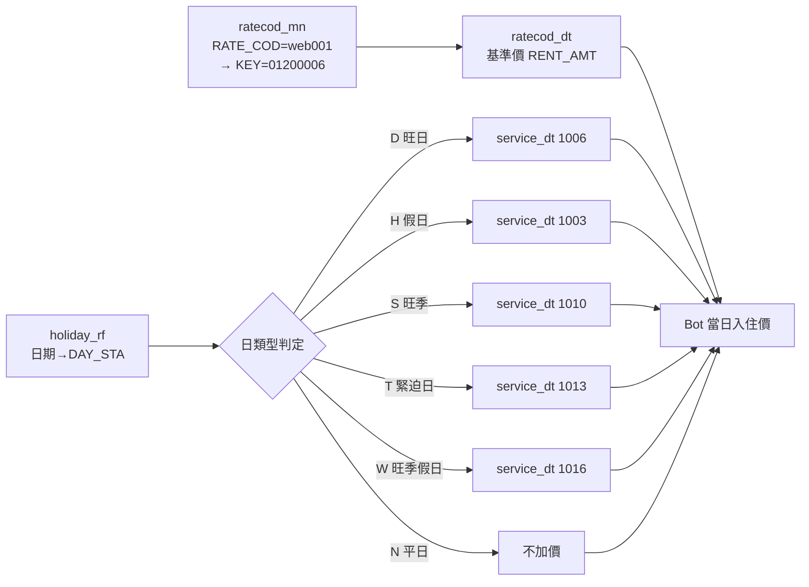

# PMS 資料庫欄位參考文檔

> 記錄 PMS (Oracle) 資料庫的重要資料表結構和欄位說明

## 📌 核心策略：文檔即接口

> **定義正確 = 結果正確。**
>
> 只要本文檔的欄位定義、狀態代碼、業務邏輯完整且正確，AI 可直接根據自然語言需求產生正確的 SQL 查詢，**不需要額外編寫 API endpoint**。
>
> 本文檔本質上是把飯店 PMS 的 know-how 數位化為 AI 可讀格式。

### 維護原則

| 原則 | 說明 |
|------|------|
| **遇到不確定，先查再定義** | 遇到未知欄位或狀態，先實際查資料庫驗證，再寫入文檔 |
| **定義只付一次學費** | 一旦確認並記錄，後續查詢不會再出錯 |
| **邊界案例必須記錄** | 特殊情況（如公帳號是虛擬房間）一定要寫清楚 |
| **禁止猜測** | 沒有事證的欄位含義不得寫入，必須經過實際驗證 |

---

## GHIST_MN - 客戶歷史主檔 ⭐

> **用途**：存放客戶的歷史記錄和備註（跨訂單、永久保存），共 82 個欄位，**6,693 筆客戶**
>
> **關聯**：透過 `GCUST_COD`（HFD 編號）或 `ID_NOS`（身分證號）關聯 GUEST_MN
>
> **特點**：備註會跟著客人，不管他住哪間房或哪次訂單

### 基本資料

| 欄位名 | 說明 | 範例值 | 備註 |
|--------|------|--------|------|
| **GCUST_COD** | 客戶唯一編號 | HFD000000000310001 | HFD 開頭，主鍵 |
| **SHOW_COD** | 顯示代碼 | HFD000000000310001 | 同 GCUST_COD |
| **LAST_NAM** | 姓 | 郭 | |
| **FIRST_NAM** | 名 | 可驥 | |
| **ALT_NAM** | 姓名 | 郭可驥 | |
| **ID_NOS** | 身分證號 | A123182837 | 🔍 主要搜尋欄位 |
| **GUEST_TYP** | 客人類型代碼 | 03 | |
| **GUEST_WAY** | 來源途徑 | | |
| **CONTRY_COD** | 國籍 | TWN | |
| **SEX_TYP** | 性別 | M | M=男, F=女 |
| **BIRTH_DAT** | 生日 | 1986-11-30 | |

### 聯絡資料

| 欄位名 | 說明 | 範例值 |
|--------|------|--------|
| **CONTACT1_RMK** | 聯絡電話1 | 0989015163 |
| **CONTACT2_RMK** | 聯絡電話2 | |
| **CONTACT3_RMK** | 聯絡電話3 | |
| **CONTACT4_RMK** | 聯絡電話4 | |
| **E_MAIL** | 電子郵件 | raintoo@hotmail.com |

### 備註與入住歷史

| 欄位名 | 說明 | 使用率 | 備註 |
|--------|------|--------|------|
| **REQUST_RMK** | ⭐ 客戶需求備註 | **204 筆** | 跨訂單永久備註 |
| **CHARACTER_RMK** | 個性備註 | 0 筆 | 未使用 |
| **ANAMNESIS** | 病歷/過敏史 | 0 筆 | 未使用 |
| **FIRST_DAT** | 首次入住日 | | |
| **LAST_DAT** | 最後入住日 | | |
| **VISIT_NOS** | 累計入住次數 | | |
| **VISITDAT_NOS** | 累計住宿天數 | | |
| **TRANS_TOT** | 累計消費金額 | | |
| **WEDDING_DAT** | 結婚紀念日 | | |

### 車輛資料

| 欄位名 | 說明 | 使用率 | 備註 |
|--------|------|--------|------|
| **CAR_NOS** | ⭐ 車牌號碼 | **4,199 筆 (63%)** | 活躍使用 |
| **CAR_BARND** | 車輛品牌 | 12 筆 | ⚠️ 實際被誤填為車輛顏色（如「紅色」「黑」） |
| **CAR_COLOR** | 車輛顏色 | 0 筆 | 未使用 |

> [!WARNING]
> `CAR_BARND` 欄位本應填車輛品牌，但館內實際填的是**車輛顏色**（紅色、黑、白色等）。`CAR_COLOR` 反而沒人用。

### 偏好設定 ⚠️ 幾乎未使用

| 欄位名 | 說明 | 使用筆數 |
|--------|------|---------|
| FAVER_FOOD | 喜好食物 | 1 |
| FAVER_DRINK | 喜好飲料 | 3 |
| FAVER_SMOKE | 吸煙偏好 | 2 |
| FAVER | 其他偏好 | 0 |
| FAVER_OTHER | 其他偏好2 | 0 |
| FAVER_NEWSPP | 報紙偏好 | 0 |
| FAVER_SPA | SPA偏好 | 0 |

> 偏好欄位幾乎沒有在填寫，目前不具實用價值。

### 其他欄位

| 欄位名 | 說明 | 備註 |
|--------|------|------|
| **VIP_STA** | VIP 狀態 | 全部為 0（未使用） |
| **CCUST_COD** | 公司客戶代碼 | CS 開頭 |
| **CCUST_NAM** | 公司名稱 | |
| **PREF_ROOM** | 偏好房型 | |
| **UNIINV_TITLE** | 發票抬頭 | |
| **UNI_COD** | 統一編號 | |
| **GHIST1~10_TYP** | 客戶分類標籤 | ⚠️ 全部 0 筆，完全未使用 |
| **AIRLINE_COD** | 航空公司代碼 | |
| **AIRMB_NOS** | 航空會員號 | |

### 查詢範例

```sql
-- 用身分證號查客戶備註
SELECT TRIM(ALT_NAM), TRIM(REQUST_RMK), TRIM(CAR_NOS)
FROM GDWUUKT.GHIST_MN
WHERE TRIM(ID_NOS) = 'A123182837';

-- 用車牌查客人
SELECT TRIM(ALT_NAM), TRIM(ID_NOS), TRIM(CONTACT1_RMK)
FROM GDWUUKT.GHIST_MN
WHERE TRIM(CAR_NOS) LIKE '%2469%';
```

### 關聯說明

```
ORDER_MN (訂單表)
├── IKEY (訂單編號)
├── CCUST_COD → GHIST_MN.CCUST_COD (公司)
└── 透過 GUEST_MN 關聯到 GHIST_MN

GUEST_MN (住客表)
├── IKEY → ORDER_MN.IKEY
├── GCUST_COD → GHIST_MN.GCUST_COD (客人)
└── ID_COD → GHIST_MN.ID_NOS
```

---

## GUEST_MN - 住客主檔

> **用途**：存放實際入住客人的詳細資料（含證件資訊）
>
> **關聯**：透過 `IKEY` (訂單號) 與 `ORDER_MN` 關聯

### 關鍵欄位

| 欄位名 | 說明 | 範例值 | 備註 |
|--------|------|--------|------|
| **ROOM_NOS** | 房號 | 606 | 實際入住房號 |
| **IKEY** | 訂單號 | 00708801 | 關聯到 ORDER_MN.IKEY |
| **IKEY_SEQ_NOS** | 訂單序號 | 1 | 同訂單多房時使用 |
| **ID_COD** | 身分證號 | M122076214 | 🔍 **可用於搜尋特定住客** |
| **FIRST_NAM** | 名（訂房） | Huang hua | 訂房時填寫的名字 |
| **LAST_NAM** | 姓（訂房） | Yen | 訂房時填寫的姓氏 |
| **ALT_NAM** | 實際登記姓名 | 洪榮宏 | ⭐ **證件掃描後的真實姓名** |
| **BIRTH_DAT** | 生日 | 1984-06-06 | 證件上的出生日期 |
| **SEX_TYP** | 性別 | M | M=男, F=女 |
| **CONTRY_COD** | 國籍 | TWN | 國家代碼 |
| **CONTACT1_COD** | 聯絡方式類型1 | 04 | 電話類型代碼 |
| **CONTACT1_RMK** | 聯絡電話1 | 0987090898 | 實際電話號碼 |
| **CI_DAT** | 入住日期 | 2025-12-13 | Check-in Date |
| **ACI_DAT** | 實際入住日期 | 2025-12-13 | Actual Check-in Date |
| **CI_TIM** | 入住時間 | 194018 | 19:40:18 |
| **RCO_DAT** | 預計退房日 | 2025-12-14 | Reservation Check-out Date |
| **ECO_DAT** | 預計退房日 | 2025-12-14 | Expected Check-out Date |
| **ACO_DAT** | 實際退房日 | NULL | Actual Check-out Date |
| **GUEST_STA** | 住客狀態 | O | O=在住/C=已退/K=公帳號 |
| **GUEST_TYP** | 客人類型 | 04 | 類型代碼 |
| **RATE_COD** | 房價代碼 | OTAnfb | OTA non-breakfast |
| **ROOM_COD** | 房型代碼 | DD | 對應到 ROOM_RF |
| **GCUST_COD** | 客戶代碼 | HFD000000000670601 | |
| **CCUST_NAM** | 公司/訂房來源 | agoda | |
| **RENT_AMT** | 房租金額 | 2131 | 實際房價 |
| **SERV_AMT** | 服務費 | 0 | |
| **MASTER_NOS** | 主房號/公帳號 | 606 / G094 | 多房關聯或公帳號集中帳款 |
| **MASTER_STA** | 是否主房 | N | Y/N |
| **REMARK1** | 備註1 | OTA定價不含早... | 訂房備註 |
| **INS_USR** | 建立人員 | root | |
| **CAR_NOS** | ⭐ 車牌號碼 | 2469 / AJQ72302 | 住客登記的車牌號碼 |

### 完整欄位列表

```
ROOM_NOS, ROOM_SER, GUEST_STA, RATE_COD, USE_COD, ROOM_COD, 
CI_DAT, ACI_DAT, CI_SER, CI_TIM, GCUST_COD, CCUST_COD, ACUST_COD, 
FIRST_NAM, LAST_NAM, ALT_NAM, GUEST_TYP, SEX_TYP, BIRTH_DAT, 
CONTRY_COD, ID_COD, CONTACT1_COD, CONTACT1_RMK, CONTACT2_COD, 
CONTACT2_RMK, CONTACT3_COD, CONTACT3_RMK, UNI_COD, ZIP_COD, 
CREDIT_NOS, EXPIRA_DAT, MASTER_NOS, MASTER_SER, IKEY, IKEY_SEQ_NOS, 
PSNGR_NOS, ACO_DAT, OUT_TIM, RCO_DAT, ECO_DAT, REMARK1, REMARK2, 
REMARK3, REMARK4, MASTER_STA, VA_STA, FLAG3_STA, FLAG4_STA, 
FLAG5_STA, PRECREDIT_AMT, INS_USR, CO_USR, SHARE_RAT, DEPOSIT_NOS, 
SYSTEM_TYP, CAR_NOS, OLD_RENT_AMT, RENT_AMT, OLD_SERV_AMT, 
SERV_AMT, UNI_TITLE, CCUST_NAM, CARRIERID2, CARRIERID1, 
CARRIERTYPE, NPOBAN, DONATEMARK, ACO_SYS_DAT, AIRLINE_COD, 
AIRMB_NOS, PERSONAL_APPRAISE, USE_DAILY_RATE
```

### 住客狀態代碼對照 (GUEST_STA) ⭐

> **2026-02-19 實際驗證確認**（310 退房前後對比、616 在住確認、G094 公帳號查詢）

| 代碼 | 說明 | ACO_DAT | 判斷 |
|:---:|:-----|:--------|:-----|
| **O** | 在住 (Occupied) | 空（NULL） | 已入住、尚未退房 |
| **C** | 已退房 (Checked-out) | 有實退日期 | 完成退房程序 |
| **K** | 公帳號 (Master Folio) | 空 | 虛擬房間（如 G094），集中帳款用 |

### 公帳號機制 (Master Folio)

> **用途**：多房集中帳款。虛擬房號（如 `G094`）不對應實體房間，多間實房透過 `MASTER_NOS` 關聯到同一個公帳號。

```
公帳號 G094 (GUEST_STA=K)
├── 602 號房 (GUEST_STA=O, 在住)
├── 508 號房 (GUEST_STA=C, 已退)
└── 516 號房 (GUEST_STA=C, 已退)

所有帳款集中記在 G094 上
```

**查詢某公帳號關聯的所有房間**：
```sql
SELECT TRIM(ROOM_NOS), TRIM(ALT_NAM), TRIM(GUEST_STA), TRIM(CAR_NOS)
FROM GDWUUKT.GUEST_MN
WHERE TRIM(MASTER_NOS) = 'G094'
  AND CI_DAT >= TO_DATE('2026-02-17','YYYY-MM-DD')
ORDER BY ROOM_NOS;
```

---

## ORDER_MN - 訂單主檔

> **用途**：存放訂房資料（訂房階段）
>
> **關聯**：透過 `IKEY` 與 `GUEST_MN` 關聯

### 關鍵欄位

| 欄位名 | 說明 | 範例值 | 備註 |
|--------|------|--------|------|
| **IKEY** | 訂單號 | 00708801 | 主鍵，關聯到 GUEST_MN |
| **RVRESERVE_NOS** | OTA訂單號 | RMAG1677888347 | 來自 Agoda/Booking 等 |
| **SOURCE_TYP** | 訂單來源 | OTA | OTA/電話/LINE等 |
| **CUST_NAM** | 顧客名稱 | agoda | 訂房來源 |
| **GLAST_NAM** | 訂房姓 | Yen | 訂房時的姓氏 |
| **GFIRST_NAM** | 訂房名 | Huang hua | 訂房時的名字 |
| **GALT_NAM** | 訂房全名 | Huang hua Yen | 組合後的全名 |
| **CONTACT1_RMK** | 聯絡電話 | 8860987090898 | |
| **CI_DAT** | 預計入住日 | 2025-12-13 | |
| **CO_DAT** | 預計退房日 | 2025-12-14 | |
| **DAYS** | 住宿天數 | 1 | |
| **ORDER_STA** | 訂單狀態 | I | N/O/I/D/C |
| **ORDER_RMK** | 訂單備註 | OTA定價不含早... | |
| **ORDER_DEPOSIT** | 訂金 | 2131 | |
| **CONFIRM_NOS** | 確認單號 | C0003884 | |
| **INS_DAT** | 建立日期 | 2025-12-13 01:16:00 | |
| **UPD_DAT** | 更新日期 | 2025-12-13 09:46:17 | |

### 訂單狀態代碼

| 代碼 | 說明 | 中文 |
|------|------|------|
| **N** | New Order | 新訂單 |
| **O** | Confirmed | 已確認 |
| **I** | Checked-In | 已入住 |
| **D** | Checked-Out | 已退房 |
| **C** | Cancelled | 已取消 |
| **R** | Reserved | 預約中 |

### OTA 訂單編號前綴對照 (RVRESERVE_NOS)

> **2026-02-19 資料庫實際統計 + 交叉驗證確認**

| 前綴 | 訂房來源 | 筆數 | SOURCE_TYP | 備註 |
|:-----|:---------|-----:|:----------:|:-----|
| **RMAG** | Agoda | 3,041 | OTA | 直連 Agoda |
| **RMWH** | 官網訂房（舊） | 950 | 04 網路 | 2022 年前使用，CUST_NAM=德安網路訂房 |
| **RMPG** | 官網訂房（新） | 907 | 04 網路 | 2025 年起使用，CUST_NAM=德安網路訂房 |
| **RMSM** | SiteMinder 串接 | 628 | OTA | 多通路 OTA 聚合（含 Agoda/Booking/攜程/易遊網等） |
| **RMBK** | Booking.com | 263 | OTA | 直連 Booking |
| **RMEX** | Expedia | 27 | OTA | 直連 Expedia |
| **RMAB** | ABC 訂房中心 | 16 | OTA/03 | 鼎業旅行社代理，2020 年底已停用 |
| **RMCT** | 攜程 (Ctrip) | 3 | OTA | 直連攜程 |
| **RMEZ** | 易遊網 | 3 | OTA | 直連易遊網 |

> [!NOTE]
> **前綴命名規則**：`RM` = Room Management（房間管理系統） + 通路縮寫（AG=Agoda, BK=Booking, EX=Expedia, CT=Ctrip, EZ=易遊, WH/PG=官網, SM=SiteMinder, AB=ABC）
>
> **RMWH vs RMPG**：都是官網訂房（德安網路訂房系統），差異在於系統世代。RMWH 為舊版（~2022），RMPG 為新版（2025~）。
>
> **RMSM 的特殊性**：SiteMinder 是 Channel Manager（通路管理器），它的訂單 CUST_NAM 會帶有實際 OTA 名稱（agoda 284 筆、booking 157 筆、expedia 14 筆、攜程 12 筆、易遊網 11 筆、四方通行 3 筆、AsiaYo 1 筆）。
>
> **數字前綴**（01AG、01BK 等）：少量早期訂單，屬同通路的不同客戶帳號。

### SOURCE_RF - 訂房來源對照表

> **用途**：定義 `ORDER_MN.SOURCE_TYP` 的所有來源類型

| SOURCE_TYP | 中文名稱 | 英文 |
|:----------:|:---------|:-----|
| 01 | 簽約客訂房 | CML |
| 02 | 國外訂房 | INB |
| 03 | 旅行社訂房 | T/A |
| 04 | 網路訂房 | WEB |
| 05 | 電話訂房 | DIR |
| 06 | 住宿券訂房 | CPN |
| 07 | 套裝行程訂房 | PKG |
| 08 | 團體 | GRP |
| 09 | LINE@ | LINE |
| DU | DayUse | DayUse |
| OFW | 官網訂房 | OFW |
| OTA | OTA | OTA |
| RT | 休息 | Rest |
| WI | Walk In | W/I |

---

## ASSIGN_DT - 房間分配表

> **用途**：記錄房間分配歷史
>
> **關聯**：透過 `IKEY` 與訂單關聯，透過 `ROOM_NOS` 與房號關聯

### 欄位

| 欄位名 | 說明 | 範例值 |
|--------|------|--------|
| **KEY_NOS** | 分配序號 | 29527 |
| **ROOM_NOS** | 房號 | 606 |
| **BEGIN_DAT** | 開始日期 | 2025-12-13 |
| **END_DAT** | 結束日期 | 2025-12-13 |
| **CO_DAT** | 退房日 | 2025-12-14 |
| **STATUS_COD** | 狀態 | C/I | C/I=已入住, C/O=已退房 |
| **IKEY** | 訂單號 | 00708801 |
| **IKEY_SEQ_NOS** | 訂單序號 | 1 |
| **GUEST_WAY** | 客人類型 | F | |
| **ROOM_COD** | 房型代碼 | DD | |

---

## ORDER_DT - 訂單明細表

> **用途**：訂單的房型明細

| 欄位名 | 說明 |
|--------|------|
| **IKEY** | 訂單號 |
| **IKEY_SEQ_NOS** | 明細序號 |
| **ROOM_COD** | 房型代碼 |
| **ORDER_QNT** | 房間數量 |
| **ADULT_QNT** | 成人數 |
| **CHILD_QNT** | 小孩數 |
| **RENT_TOT** | 租金總額 |

---

## 資料表關聯圖

```
訂房流程：

1. 訂房階段
   ORDER_MN (訂單主檔)
   ├─ IKEY: 00708801
   ├─ GLAST_NAM: Yen (訂房姓名)
   ├─ GFIRST_NAM: Huang hua
   └─ ORDER_STA: N → O (新訂單 → 已確認)

2. 入住階段
   GUEST_MN (住客主檔)
   ├─ IKEY: 00708801 ← 關聯到 ORDER_MN
   ├─ LAST_NAM: Yen (訂房姓名)
   ├─ FIRST_NAM: Huang hua
   ├─ ALT_NAM: 洪榮宏 ⭐ (證件姓名)
   ├─ ID_COD: M122076214 (身分證)
   └─ ROOM_NOS: 606

   ASSIGN_DT (房間分配)
   ├─ IKEY: 00708801
   ├─ ROOM_NOS: 606
   └─ STATUS_COD: C/I (已入住)

3. 退房階段
   GUEST_MN.ACO_DAT 更新
   ORDER_MN.ORDER_STA → D (已退房)
```

---

## 常用查詢範例

### 1. 查詢今日入住客人（含證件姓名）

```sql
SELECT 
    om.IKEY as 訂單號,
    om.GLAST_NAM || om.GFIRST_NAM as 訂房姓名,
    gm.ALT_NAM as 登記姓名,
    gm.ID_COD as 身分證號,
    gm.ROOM_NOS as 房號,
    gm.CI_DAT as 入住日,
    gm.CONTACT1_RMK as 電話
FROM GDWUUKT.ORDER_MN om
LEFT JOIN GDWUUKT.GUEST_MN gm ON om.IKEY = gm.IKEY
WHERE TRUNC(om.CI_DAT) = TRUNC(SYSDATE)
AND om.ORDER_STA = 'I'
ORDER BY gm.ROOM_NOS
```

### 2. 用身分證號查詢住客

```sql
SELECT * 
FROM GDWUUKT.GUEST_MN 
WHERE TRIM(ID_COD) = 'M122076214'
```

### 3. 用房號查詢目前住客

```sql
SELECT 
    ROOM_NOS as 房號,
    LAST_NAM || FIRST_NAM as 訂房姓名,
    ALT_NAM as 登記姓名,
    ID_COD as 身分證,
    CI_DAT as 入住日,
    RCO_DAT as 預計退房
FROM GDWUUKT.GUEST_MN
WHERE TRIM(ROOM_NOS) = '606'
AND GUEST_STA = 'O'
```

### 4. 查詢訂單的房間分配歷史

```sql
SELECT 
    ROOM_NOS,
    BEGIN_DAT,
    CO_DAT,
    STATUS_COD
FROM GDWUUKT.ASSIGN_DT
WHERE TRIM(IKEY) = '00708801'
ORDER BY BEGIN_DAT DESC
```

---

## 其他重要資料表

### RSORDER_MN - 餐廳訂單主檔

- **FULL_NAM**: 訂餐人姓名
- **ID_NOS**: 身分證號
- **ORDER_NOS**: 關聯訂單號（如有）

### ROOM_RF - 房型參考表

- **ROOM_TYP**: 房型代碼 (如 DD, SD, ST)
- **ROOM_NAM**: 房型名稱

---

## ROOM_MN - 房間主檔 ⭐

> **用途**：存放每個實體房間的狀態（清潔、停用、入住等）
>
> **關聯**：透過 `ROOM_NOS`（房號）與 GUEST_MN 關聯

### 清潔狀態相關欄位

| 欄位名 | 類型 | 說明 | 範例值 |
|--------|------|------|--------|
| **ROOM_NOS** | NCHAR | 房號 | 201, 606 |
| **FLOOR_NOS** | NCHAR | 樓層 | 2, 6 |
| **ROOM_COD** | NCHAR | 房型代碼 | SQ, SD, DD |
| **ROOM_STA** | NCHAR | 房間狀態 | V=空房, O=入住中 |
| **CLEAN_STA** | NCHAR | ⭐ **清潔狀態** | **C=乾淨, D=髒, I=待檢查** |
| **OOS_STA** | NCHAR | ⭐ **停用狀態** | **N=正常, Y=停用/維修** |
| **OSRESON_RMK** | NVARCHAR2 | 停用原因 | "門檔斷掉" |
| **ASSIGN_STA** | NCHAR | 分配狀態 | N |
| **CI_DAT** | DATE | 入住日期 | 2025-12-14 |
| **CO_DAT** | DATE | 退房日期 | 2025-12-15 |

### 人數相關欄位

| 欄位名 | 說明 |
|--------|------|
| **ADULT_QNT** | 成人數 |
| **CHILD_QNT** | 兒童數 |
| **BABY_QNT** | 嬰兒數 |
| **WOMAN_QNT** | 女性數 |
| **AEXBED_QNT** | 成人加床數 |
| **CEXBED_QNT** | 兒童加床數 |

### 其他欄位

| 欄位名 | 說明 |
|--------|------|
| **CHARACTER_RMK** | 房間備註（如"一大二小"）|
| **USER_RMK** | 使用者備註 |
| **BED_STA** | 床位狀態 |
| **ALARM_TIM** | 鬧鐘時間 |
| **ALARM_DAT** | 鬧鐘日期 |
| **CO_CLEAN_PTS** | 退房清潔積分 |
| **STAY_CLEAN_PTS** | 續住清潔積分 |
| **INS_DAT/INS_USR** | 建立日期/人員 |
| **UPD_DAT/UPD_USR** | 更新日期/人員 |

### 清潔狀態代碼對照

| 代碼 | 說明 | 中文 | 顏色建議 |
|------|------|------|---------|
| **C** | Clean | 乾淨 | 🟢 綠色 |
| **D** | Dirty | 髒（待清掃）| 🔴 紅色 |
| **I** | Inspecting | 待檢查 | 🟡 黃色 |

### 房間狀態代碼對照 (ROOM_STA)

| 代碼 | 說明 | 中文 | 可售？ | 說明 |
|:---:|:-----|:-----|:------:|:-----|
| **V** | Vacant | 空房 | ✅ 可售 | 無人住宿 |
| **O** | Occupied | 入住中 | ❌ 有人住 | 已有客人入住 |
| **R** | Repair | 維修/故障 | ❌ 不可售 | 正在維修，無法販售 |

### 瑕疵狀態代碼對照 (OOS_STA)

| 值 | 欄位值 | 說明 | 可售？ |
|:--:|:------:|:-----|:------:|
| **Y** | `True` | 有瑕疵 | ✅ 可售 |
| **N** | `False` | 正常 | ✅ 可售 |

> [!IMPORTANT]
> **瑕疵房 vs 維修房 的區別**
>
> | 類型 | 判斷條件 | 範例 | 能否販售 |
> |:-----|:---------|:-----|:--------:|
> | **瑕疵房** | `OOS_STA = Y` 且 `ROOM_STA = V` | 門檔斷掉、冰箱異常 | ✅ 可售 |
> | **維修房** | `ROOM_STA = R` | 整修中、漏水嚴重 | ❌ 不可售 |
>
> **空房計算公式**：
> - 可售總房 = 總房數 - 維修房 (R)
> - 可售空房 = 空房 (V)
> - 住房率 = 在住 (O) / 可售總房

### 實際範例 (2025-12-21)

**維修房 (room_status = R)**：共 4 間
- 205, 212, 605, 612

**瑕疵房 (oos_status = Y, room_status = V)**：共 15 間
- 有小問題但仍可販售（如門檔斷掉、燈故障等）

### 查詢範例

```sql
-- 查詢所有房間清潔狀態
SELECT 
    ROOM_NOS as 房號,
    ROOM_COD as 房型,
    ROOM_STA as 房間狀態,
    CLEAN_STA as 清潔狀態,
    OOS_STA as 停用狀態,
    OSRESON_RMK as 停用原因
FROM GDWUUKT.ROOM_MN
ORDER BY ROOM_NOS

-- 查詢需要清掃的房間
SELECT ROOM_NOS 
FROM GDWUUKT.ROOM_MN 
WHERE CLEAN_STA = 'D' AND OOS_STA = 'N'

-- 查詢維修中的房間
SELECT ROOM_NOS, OSRESON_RMK 
FROM GDWUUKT.ROOM_MN 
WHERE OOS_STA = 'Y'
```

---

## 注意事項

1. **字元集問題**：Oracle 使用字元集 ID 871（繁體中文），Node.js 必須使用 **Thick 模式**
2. **TRIM 函數**：許多欄位有尾隨空格，查詢時建議使用 `TRIM()`
3. **日期欄位**：使用 `TRUNC()` 來比對日期（忽略時間）
4. **NULL 處理**：未填寫的欄位可能是 NULL，需要用 `COALESCE()` 或 `NVL()` 處理

---

## WRS_STOCK_DT - 網路庫存表 ⭐

> **用途**：管理放到網路（OTA）上的房間庫存
>
> **WRS 鎖控**：PMS 系統的庫存控制機制，區分「網路庫存」與「館內庫存」

### 關鍵欄位

| 欄位名 | 類型 | 說明 | 備註 |
|--------|------|------|------|
| **HOTEL_COD** | NCHAR(12) | 飯店代碼 | 固定 '01' |
| **ROOM_COD** | NCHAR(12) | 房型代碼 | SD, CD, WD... |
| **BATCH_DAT** | DATE | 日期 | 查詢條件 |
| **STOCK_QNT** | NUMBER | ⭐ **網路總庫存** | 放到 OTA 的數量 |
| **USE_QNT** | NUMBER | 已訂數量 | OTA 已訂走的 |
| **UPLOAD_STA** | NCHAR(3) | 上傳狀態 | Y=已同步到網路 |
| **AUTO_STOCK_STA** | NCHAR(3) | 自動控管 | Y=自動庫存管理 |

### 計算公式

```
網路可預訂數 = STOCK_QNT - USE_QNT
```

### 查詢範例

```sql
-- 查詢今日各房型網路庫存
SELECT 
    TRIM(ROOM_COD) as 房型,
    STOCK_QNT as 網路庫存,
    USE_QNT as 已訂,
    (STOCK_QNT - USE_QNT) as 可訂
FROM GDWUUKT.WRS_STOCK_DT 
WHERE TRUNC(BATCH_DAT) = TRUNC(SYSDATE)
ORDER BY ROOM_COD
```

---

## RMINV_MN - 房間庫存主檔 ⭐

> **用途**：記錄各房型的完整庫存狀況（館內層級）
>
> **特點**：包含總房數、館內剩餘、停用房、已訂等完整資訊

### 關鍵欄位

| 欄位名 | 類型 | 說明 | 備註 |
|--------|------|------|------|
| **HOTEL_COD** | NCHAR | 飯店代碼 | 固定 '01' |
| **BATCH_DAT** | DATE | 日期 | 查詢條件 |
| **ROOM_COD** | NCHAR | 房型代碼 | SD, CD, WD... |
| **ROOM_QNT** | NUMBER | 房型總房數 | 實體房間數 |
| **LEFT_QNT** | NUMBER | ⭐ **館內剩餘庫存** | 櫃檯可用數 |
| **OOO_QNT** | NUMBER | 停用/維修房數 | Out of Order |
| **ORDER_QNT** | NUMBER | 已預訂數 | 總預訂數 |
| **USE_QNT** | NUMBER | 使用中 | 目前入住數 |
| **BLOCK_QNT** | NUMBER | 控房數 | 被鎖定的房 |
| **REST_QNT** | NUMBER | 剩餘 | - |

### 查詢範例

```sql
-- 查詢今日各房型館內庫存
SELECT 
    TRIM(ROOM_COD) as 房型,
    ROOM_QNT as 總房數,
    LEFT_QNT as 館內剩餘,
    OOO_QNT as 停用
FROM GDWUUKT.RMINV_MN 
WHERE TRUNC(BATCH_DAT) = TRUNC(SYSDATE)
ORDER BY ROOM_COD
```

---

## 庫存系統總結

### 庫存類型對照表

| 庫存類型 | 資料表 | 欄位 | 說明 |
|----------|--------|------|------|
| 🌐 **網路庫存** | `WRS_STOCK_DT` | `STOCK_QNT` | 放到 OTA 的總數 |
| 🌐 **網路可訂** | `WRS_STOCK_DT` | `STOCK_QNT - USE_QNT` | 網路實際可訂 |
| 🏨 **館內庫存** | `RMINV_MN` | `LEFT_QNT` | 櫃檯可用數量 |
| 📊 **總房數** | `RMINV_MN` | `ROOM_QNT` | 房型實體房間 |
| 🔧 **停用房** | `RMINV_MN` | `OOO_QNT` | 維修中房間 |

### 庫存邏輯說明

1. **網路庫存**：由館方主動「放上去」給 OTA 販售
2. **館內庫存**：PMS 自動計算的剩餘可用房間
3. **WRS 鎖控**：控制網路庫存的機制，可隨時拉回

---

## WRS_ROOM_PRICE - 房間價格表 ⭐

> **用途**：記錄各房型按日期的價格（浮動定價）
>
> **特點**：週末/假日可設定不同價格，由 PMS 排程系統預先計算

### 關鍵欄位

| 欄位名 | 類型 | 說明 | 備註 |
|--------|------|------|------|
| **CI_DAT** | DATE | 入住日期 | 查詢條件 |
| **ROOM_COD** | NCHAR | 房型代碼 | ST, SD, SQ... |
| **PAY_TOT** | NUMBER | ⭐ **房價總額** | ROOM_AMT + OTHER_AMT |
| **ROOM_AMT** | NUMBER | 房間金額 | 基準房價部分 |
| **OTHER_AMT** | NUMBER | 其他金額 | 累計加價部分 |
| **DAYS** | NUMBER | 天數 | 單日=1，多日包=N |
| **PRODUCT_NOS** | NCHAR | 產品編號 | 見下表 |

### PRODUCT_NOS 對照

| PRODUCT_NOS | 房型 | 名稱 |
|-------------|------|------|
| `20001901` | ST | 官網優惠價ST |
| `20002301` | SQ | 官網優惠價SQ |

> ⚠️ 查詢時需使用正確的 PRODUCT_NOS，不同房型對應不同編號。

---

## 🎯 房價動態計算系統（核心）

> **2026-02-18 完整破解並通過 PMS CLI 驗證 ✅**
>
> Bot 當日入住價公式：`ratecod_dt 基準價（含早）+ 日類型對應加價`

### 完整定價流程鏈

```
ratecod_dt (基準價)  →  PMS試算(wrs01t0010)  →  WRS_ROOM_PRODUCT (通路價)  →  +加價  →  WRS_ROOM_PRICE (通路售價)
  SQ: 3,280                                      SQ: 3,680 (舊基準⚠️)                        官網旺日: 5,180 / OTA: 20,000
```

> **Bot 使用基準價直接計算**（非通路價），形成當日入住「晚鳥價」策略。
> 官網通路價 (`WRS_ROOM_PRICE`) 因未重新試算，仍使用舊基準 3,680。**此差異為刻意保留**。

### Bot 價格計算關聯圖



---

## HOLIDAY_KIND_RF - 日類型定義 ⭐

> **用途**：定義所有日類型代碼及名稱

### 關鍵欄位

| 欄位名 | 類型 | 說明 | 備註 |
|--------|------|------|------|
| **DAY_STA** | NCHAR | 日類型代碼 | N/D/H/S/T/W |
| **DAY_NAM** | NVARCHAR | 日類型名稱 | 平日/旺日/假日... |
| **COLOR_NUM** | NUMBER | 顯示色碼 | PMS 日曆顏色 |

### 完整日類型

| DAY_STA | 名稱 | 對應加價 SERV_COD |
|---------|------|------------------|
| `N` | 平日 | 無 |
| `D` | 旺日 | `1006` |
| `H` | 假日 | `1003` |
| `S` | 旺季 | `1010` |
| `T` | 緊張日 | `1013` |
| `W` | 旺季假日 | `1016` |

---

## HOLIDAY_RF - 日期分類表 ⭐

> **用途**：將每一天對應到日類型（平日/旺日/假日...）

### 關鍵欄位

| 欄位名 | 類型 | 說明 | 備註 |
|--------|------|------|------|
| **BATCH_DAT** | DATE | 日期 | 查詢條件 |
| **DAY_STA** | NCHAR | 日類型代碼 | 參照 HOLIDAY_KIND_RF |
| **HOTEL_COD** | NCHAR | 旅館代碼 | `01` |

### 查詢範例

```sql
-- 查詢今天的日類型
SELECT DAY_STA FROM GDWUUKT.HOLIDAY_RF
WHERE TRUNC(BATCH_DAT) = TRUNC(SYSDATE);
```

---

## RATECOD_MN - 費率主檔 ⭐

> **用途**：定義費率代碼與唯一鍵的對應關係

### 關鍵欄位

| 欄位名 | 類型 | 說明 | 備註 |
|--------|------|------|------|
| **KEY** | NCHAR | 費率唯一鍵 | 全系統關聯用 |
| **RATE_COD** | NCHAR | 費率代碼 | `web001`=官網優惠價 |
| **REMARK2** | NVARCHAR | 備註 | 如「基準價」 |

### 重要值

| KEY | RATE_COD | 說明 |
|-----|----------|------|
| `01200006` | `web001` | 官網優惠價 |

---

## RATECOD_DT - 費率明細表（基準價）⭐

> **用途**：存放各房型在特定費率下的基準售價（含早餐）

### 關鍵欄位

| 欄位名 | 類型 | 說明 | 備註 |
|--------|------|------|------|
| **KEY** | NCHAR | 費率唯一鍵 | 連結 RATECOD_MN |
| **ROOM_COD** | NCHAR | 房型代碼 | ST/SD/SQ |
| **RENT_AMT** | NUMBER | ⭐ **基準售價（含早餐）** | 實際計算基準 |
| **SERV_AMT** | NUMBER | 服務旗標 | 1.0 |

### web001 各房型基準價

| 房型 | RENT_AMT | 組成 |
|------|----------|------|
| SD（標準三人房） | 2,280 | 房租 + 早餐 250×2 |
| ST（標準雙人房） | 2,880 | 房租 + 早餐 250×2 |
| SQ（標準四人房） | 3,280 | 房租 2,280 + 早餐 250×4 |

---

## SERVICE_RF - 服務項目定義表 ⭐

> **用途**：定義所有附加服務的代碼、名稱與類型

### 關鍵欄位

| 欄位名 | 類型 | 說明 | 備註 |
|--------|------|------|------|
| **ITEM_NOS** | NCHAR | 服務代碼 | = SERV_COD |
| **ITEM_NAM** | NVARCHAR | 服務名稱 | 如「旺日加價」 |
| **ITEM_AMT** | NUMBER | 預設金額 | 實際金額在 SERVICE_DT |
| **CHARG_TYP** | NCHAR | 計費類型 | Q=房間, I=人頭 |
| **COMMAND_OPTION** | NCHAR | ⭐ **日類型映射** | `H` + DAY_STA |
| **SERV_TYP** | NCHAR | 服務分類 | `07`=房務類 |
| **SMALL_TYP** | NCHAR | 小分類 | `101`=加價類 |

### 房價相關服務項目

| ITEM_NOS | 名稱 | COMMAND_OPTION | 對應 DAY_STA | CHARG_TYP |
|----------|------|---------------|-------------|-----------|
| `1001` | 房租 | *(空)* | — | Q（每房） |
| `1003` | 假日加價 | `HH` | H | Q |
| `1006` | 旺日加價 | `HD` | D | Q |
| `1010` | 旺季加價 | `HS` | S | Q |
| `1013` | 緊迫日加價 | `HT` | T | Q |
| `1016` | 旺季假日 | `HW` | W | Q |
| `2008` | 客房早餐 | — | — | I（每人） |

> **映射規則**：`COMMAND_OPTION` = `"H"` + `DAY_STA`（可動態查詢）

---

## SERVICE_DT - 服務金額明細表 ⭐

> **用途**：存放各費率+房型組合下的附加服務金額

### 關鍵欄位

| 欄位名 | 類型 | 說明 | 備註 |
|--------|------|------|------|
| **KEY** | NCHAR | 費率唯一鍵 | 連結 RATECOD_MN |
| **ROOM_COD** | NCHAR | 房型代碼 | ST/SD/SQ |
| **SERV_COD** | NCHAR | 服務代碼 | 連結 SERVICE_RF.ITEM_NOS |
| **ITEM_AMT** | NUMBER | ⭐ **加價金額** | 實際使用金額 |
| **SERV_QNT** | NUMBER | 服務數量 | 早餐=人數 |

### web001 各房型加價一覽

| SERV_COD | 名稱 | SQ（四人房） | SD（三人房） |
|----------|------|-------------|-------------|
| 1003 | 假日加價 | 500 | 200 |
| 1006 | 旺日加價 | 1,500 | 700 |
| 1010 | 旺季加價 | 500 | 200 |
| 1013 | 緊迫日加價 | 3,000 | 1,400 |
| 1016 | 旺季假日 | 500 | 200 |
| 2008 | 客房早餐 | 250×4人 | 250×2人 |

### 查詢範例

```sql
-- 查詢 SQ 房型在 web001 費率下的旺日加價金額
SELECT ITEM_AMT FROM GDWUUKT.SERVICE_DT
WHERE KEY IN (SELECT KEY FROM GDWUUKT.RATECOD_MN WHERE TRIM(RATE_COD) = 'web001')
  AND TRIM(ROOM_COD) = 'SQ'
  AND TRIM(SERV_COD) = '1006';
-- 結果：1500
```

---

## 正確的房價計算邏輯

```sql
-- 步驟 1：取基準價（含早）
SELECT RENT_AMT FROM GDWUUKT.RATECOD_DT
WHERE KEY IN (SELECT KEY FROM GDWUUKT.RATECOD_MN WHERE TRIM(RATE_COD) = 'web001')
  AND TRIM(ROOM_COD) = :room_type;

-- 步驟 2：取今天日類型
SELECT DAY_STA FROM GDWUUKT.HOLIDAY_RF
WHERE TRUNC(BATCH_DAT) = TRUNC(SYSDATE);

-- 步驟 3：根據日類型找對應加價服務代碼
SELECT ITEM_NOS FROM GDWUUKT.SERVICE_RF
WHERE TRIM(COMMAND_OPTION) = 'H' || :day_sta;

-- 步驟 4：取加價金額
SELECT ITEM_AMT FROM GDWUUKT.SERVICE_DT
WHERE KEY IN (SELECT KEY FROM GDWUUKT.RATECOD_MN WHERE TRIM(RATE_COD) = 'web001')
  AND TRIM(ROOM_COD) = :room_type
  AND TRIM(SERV_COD) = :serv_cod_from_step3;

-- 步驟 5：總價 = RENT_AMT + ITEM_AMT（平日 ITEM_AMT 為 0）
```

### 驗證結果（2026-02-18 PMS CLI 確認）

| 日期 | 日類型 | 房型 | 基準價 | 加價 | 總價 |
|------|--------|------|--------|------|------|
| 02/18 | D 旺日 | SQ | 3,280 | +1,500 | **4,780** ✅ |
| 02/25 | N 平日 | SQ | 3,280 | 0 | **3,280** ✅ |
| 02/25 | N 平日 | SD | 2,280 | 0 | **2,280** ✅ |
| 03/21 | H 假日 | SQ | 3,280 | +500 | **3,780** ✅ |
| 03/21 | H 假日 | SD | 2,280 | +200 | **2,480** ✅ |

---

## 已知問題與限制

### 退房還原訂單的姓名顯示

**問題描述**：
- 經過「退房 → 還原」操作的訂單，`GALT_NAM` 欄位可能因 Oracle NCHAR 固定長度特性導致空值檢查失效
- 即使 `LENGTH(TRIM(GALT_NAM)) > 0` 仍可能無法正確取得姓名

**影響範圍**：
- 少數經過退房還原的訂單
- 顯示為 `CUST_NAM`（如「電話或Line訂房」）而非實際姓名

**暫不處理**：
- 此情況發生機率極低
- 不影響正常訂單流程
- 已記錄供未來參考

**範例訂單**：00709801

### PMS API 已知 Bug

> ⚠️ [rooms.js](file:///Users/ktw/ktw-projects/ktw-bot/pms-api/routes/rooms.js) 的 `today-availability` 端點存在以下問題：

1. **PRODUCT_NOS 硬編碼**：只使用 `20001901`（ST），SQ 應為 `20002301`
2. **DAYS 篩選問題**：固定 `DAYS = 1` 但部分房型僅有多日包價格
3. **未使用動態加價邏輯**：未查詢 `holiday_rf` + `service_dt` 計算日類型加價

---

## OTA 訂單編號前綴對照

| 前綴 | 訂房來源 |
|:-----|:---------|
| RMAG | Agoda |
| RMBK | Booking.com |
| RMEX | Expedia |
| RMCPT | 攜程 |
| RMPGP | 官網 |
| 無OTA編號 | 手KEY |

---

*最後更新：2026-02-18*
*資料來源：PMS Server (192.168.8.3) - GDWUUKT Schema*
